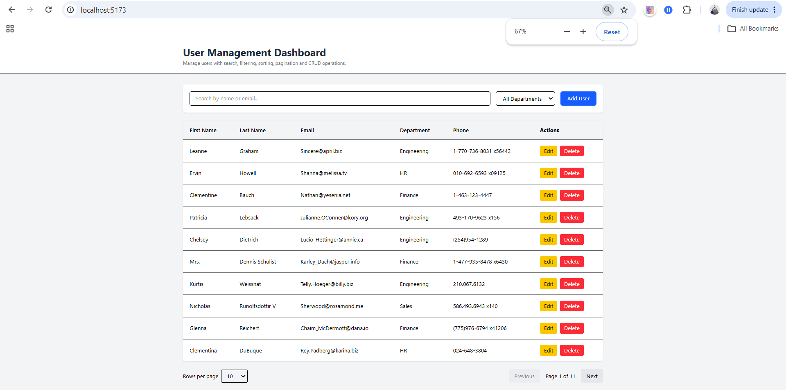
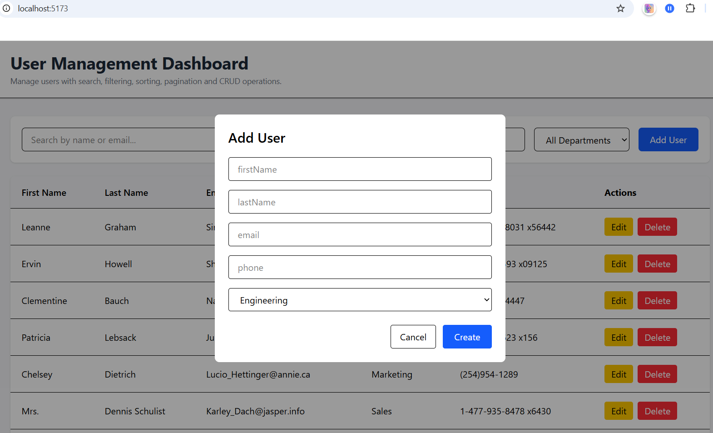
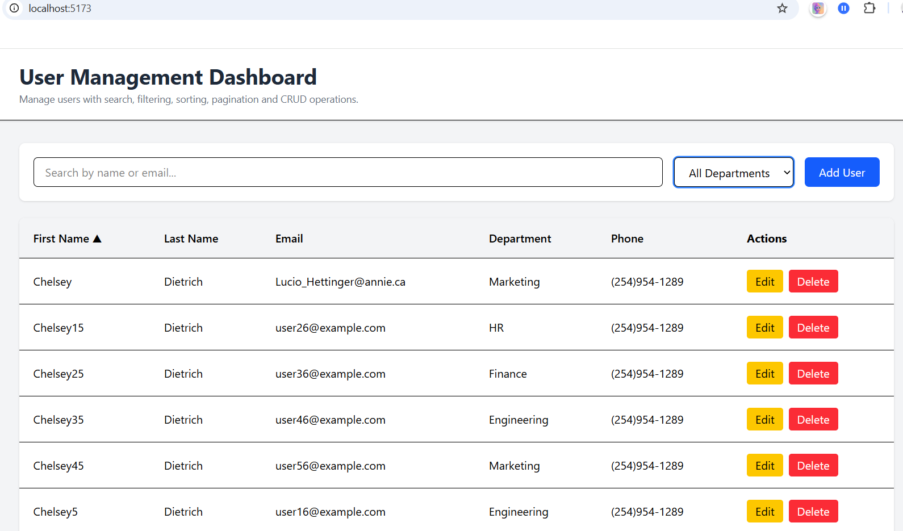
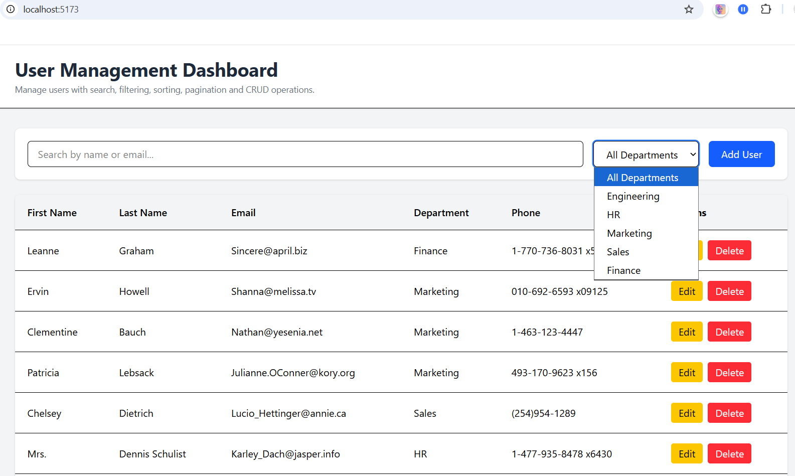
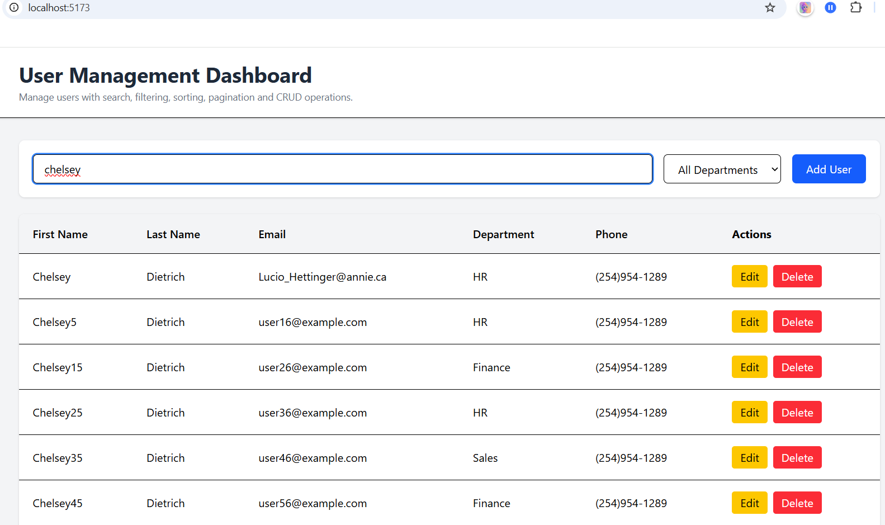

# User Management Dashboard

A clean, responsive User Management Dashboard built with **React**, **Vite**, **Tailwind CSS**, and **Axios**.

The application demonstrates complete client-side CRUD functionality, searching, filtering, sorting, pagination, form validation, and unit testing while consuming the JSONPlaceholder API.

> **Note:** Since JSONPlaceholder is a mock REST API and does not persist data, all Create, Update, and Delete operations are simulated by updating the local React state after receiving a successful API response.

---

## Dashboard



---

## Add User



---

## Sorting Users



---

## Filter



---

## Search



---

## Features

- View users in a responsive data table
- Add new users
- Edit existing users
- Delete users with confirmation
- Search by First Name, Last Name, or Email
- Filter users by Department
- Sort users by clicking table headers
- Client-side pagination
- Loading state while fetching data
- Success/Error alert messages
- HTML5 form validation with browser validation messages
- Unit tests using Vitest and React Testing Library

---

## Tech Stack

- React (Vite)
- Tailwind CSS
- Axios
- Vitest
- React Testing Library
- JavaScript (ES6+)

---

## Project Structure

```text
src/
│
├── api/
│   └── users.js
│
├── components/
│   ├── AlertBanner.jsx
│   ├── Header.jsx
│   ├── Loader.jsx
│   ├── Pagination.jsx
│   ├── SearchBar.jsx
│   ├── UserModal.jsx
│   └── UserTable.jsx
│
├── utils/
│   ├── constants.js
│   ├── sortUsers.js
│   └── transformUsers.js
│
├── tests/
│   ├── api/
│   ├── components/
│   ├── utils/
│   └── setup.js
│
├── App.jsx
└── main.jsx
```

---

# Getting Started

## Prerequisites

- Node.js (v18 or later recommended)
- npm

---

## Installation

Clone the repository

```bash
git clone https://github.com/Reet1010/user-management-dashboard
```

Navigate into the project

```bash
cd user-management-dashboard
```

Install dependencies

```bash
npm install
```

---

## Running the Application

Start the development server

```bash
npm run dev
```

The application will be available at

```
http://localhost:5173
```

---

## Running Tests

Run all tests

```bash
npm test
```

Generate test coverage

```bash
npm run coverage
```

---

# API

This project uses:

```
https://jsonplaceholder.typicode.com/users
```

---

# Assumptions Made

## 1. Data Transformation

The JSONPlaceholder API returns a single `name` field.

To support searching and sorting by first and last name, the application transforms the data into:

```javascript
{
  (firstName, lastName);
}
```

during the initial fetch.

---

## 2. Department Field

The API does not provide a department.

A department is randomly assigned from:

- Engineering
- HR
- Marketing
- Sales
- Finance

This happens only once when users are transformed.

---

## 3. CRUD Persistence

JSONPlaceholder accepts POST, PUT, and DELETE requests but does not actually persist data.

Therefore:

- POST immediately prepends the new user into local state.
- PUT updates the matching user inside local state.
- DELETE removes the user from local state.

This simulates the behavior of a real backend while still making genuine HTTP requests.

---

## 4. Additional Mock Users

The API only returns 10 users.

To properly demonstrate:

- pagination
- searching
- filtering
- sorting

the application programmatically generates additional mock users after fetching the original dataset.

This allows all required functionality to be meaningfully demonstrated without relying on another API.

---

## 5. Pagination

Pagination is entirely client-side.

Changing:

- search
- department filter

automatically resets the current page to page 1 to avoid invalid page states.

---

## 6. Form Validation

Instead of maintaining custom validation messages and regular expressions, the application uses the browser's native HTML5 validation via:

- required
- email input type
- validationMessage
- checkValidity()

This keeps validation lightweight while leveraging built-in browser behavior.

---

## 7. Responsive Design

The dashboard is designed primarily for desktop and tablet usage.

The table is horizontally scrollable on smaller screens to preserve usability.

---

# Architecture Decisions

The project separates concerns into three layers.

### API Layer

Responsible only for communicating with the backend.

```
api/
```

---

### Utility Layer

Contains pure business logic such as:

- user transformation
- sorting

Keeping this logic separate makes it easier to unit test.

---

### Components

Reusable UI components that receive data via props.

Business logic remains centralized in `App.jsx`.

---

# Testing

The project includes unit tests for:

### Utility Functions

- transformUsers
- sortUsers

### API Layer

- GET users
- POST user
- PUT user
- DELETE user

using mocked Axios requests.

### React Components

- Pagination
- UserTable
- UserModal

Tests cover rendering, callbacks, form submission, and user interactions.

---

# Challenges Faced

### 1. JSONPlaceholder Limitations

The biggest challenge was that JSONPlaceholder only returns ten users and does not persist mutations.

To overcome this:

- additional users were generated programmatically
- CRUD operations update local React state after successful API responses

This provides a realistic user experience while still using the provided API.

---

### 2. Missing Data

The API does not expose:

- first name
- last name
- department

These values were derived or generated during data transformation to satisfy the assignment requirements.

---

### 3. State Synchronization

Managing search, filtering, sorting, pagination, and CRUD simultaneously required careful ordering of derived state.

Whenever filters change, pagination is reset to avoid invalid page numbers.

---

### 4. Testing

Because API requests are mocked, the API layer required Axios mocking with Vitest to ensure deterministic and isolated unit tests.

---

# Future Improvements

If given more time, I would make the following improvements:

### Architecture

- Extract business logic into custom hooks such as:
  - `useUsers`
  - `usePagination`
  - `useAlerts`

This would reduce the responsibility of `App.jsx` and improve testability.

---

### UI/UX

- Replace the browser confirmation dialog with a custom confirmation modal.
- Add keyboard accessibility (Escape to close modal, focus trapping).
- Improve mobile responsiveness with a card-based layout.
- Display record counts such as "Showing 21–40 of 110 users."

---

### Performance

- Virtualize large tables for thousands of users.
- Debounce search input.
- Memoize additional derived state where appropriate.

---

### Production Features

- Authentication and role-based access.
- Backend persistence with a real database.
- Server-side pagination, searching, and sorting.
- Optimistic updates with rollback on API failure.
- Toast notifications.
- Dark mode.

---

# Design Philosophy

The assignment emphasized functionality over visual complexity.

The implementation therefore focuses on:

- clean code organization
- reusable components
- separation of concerns
- maintainability
- predictable state management
- comprehensive unit testing

while keeping the user interface minimal, responsive, and easy to use.

---

## Author

**Ritik Yadav**
